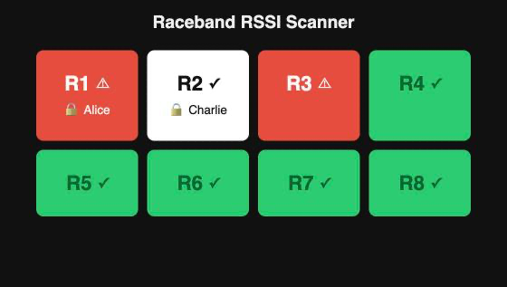

# Raceband RSSI Scanner

[](LICENSE)

Scans all 8 channels of the analog FPV Raceband (5658-5917 MHz) with a
single RX5808/RTC6715-based receiver module and reports RSSI per channel
over serial. Since one receiver can only listen to one frequency at a time,
"monitoring 8 channels" means continuously re-tuning the module across all
8 Raceband channels and sampling RSSI after each retune (a frequency sweep),
rather than listening to all 8 simultaneously.

## Hardware

Any RX5808 module works, including a modified RC832 with its RTC6715 tuner
chip's SPI control lines exposed (the standard "RX5808 SPI mod": bridging or
removing the onboard resistor/pad that ties the bus-select pin low, freeing
up DATA/CLK/LE for direct microcontroller control instead of the module's
onboard button-scan logic).

You'll also need one LED per Raceband channel (each with a current-limiting
resistor, e.g. 220Ω) to show that channel's busy/free state.

### Wiring

Wire everything to an Arduino Uno/Nano (ATmega328P) as follows:

| Signal                | Arduino pin |
|------------------------|------------|
| RX5808/RC832 DATA       | D10        |
| RX5808/RC832 CLK        | D11        |
| RX5808/RC832 LE / SEL (CS) | D12     |
| RX5808/RC832 RSSI       | A0         |
| RX5808/RC832 GND        | GND        |
| RX5808/RC832 3.3V / 5V  | per your module's onboard regulator |
| R1 busy/free LED        | D2         |
| R2 busy/free LED        | D3         |
| R3 busy/free LED        | D4         |
| R4 busy/free LED        | D5         |
| R5 busy/free LED        | D6         |
| R6 busy/free LED        | D7         |
| R7 busy/free LED        | D8         |
| R8 busy/free LED        | D9         |

LEDs wire from their pin, through the resistor, to GND. Each LED lights up
whenever that specific channel is considered busy (see below).

RX5808 pin assignments are `#define`s at the top of `include/rx5808.h`
(overridable via `build_flags`, see the `promicro16` env below); LED pin
assignments are `CHANNEL_STATE_LED_PINS` in `src/main.cpp` - change either
if you need different pins.

#### Arduino Pro Micro

The Pro Micro (ATmega32U4) doesn't break out D11/D12 on its header, so the
`promicro16` build environment remaps the RX5808 bus to D14-D16 instead:

| Signal                | Arduino pin |
|------------------------|------------|
| RX5808/RC832 DATA       | D14        |
| RX5808/RC832 CLK        | D15        |
| RX5808/RC832 LE / SEL (CS) | D16     |
| RX5808/RC832 RSSI       | A0         |

LED wiring (D2-D9) is unchanged.

#### ESP32

The ESP32's WiFi is used to serve a live channel-status web page (see
below), so the `esp32` build environment moves every pin off the AVR
defaults: GPIO6-11 are wired internally to the module's flash chip and
can't be used as GPIOs, and GPIO0/2/5/12/15 are boot-mode strapping pins
best left alone. RSSI is the only signal read with `analogRead()`, and
WiFi takes over ADC2 for as long as it's active, so RSSI specifically
needs an ADC1 pin - hence GPIO34. The LED pins are plain `digitalWrite()`
outputs, so a few of them (GPIO25/26/27) doubling as ADC2 channels doesn't
matter - that conflict only affects analog reads on a pin, not digital
I/O.

| Signal                | ESP32 pin |
|------------------------|----------|
| RX5808/RC832 DATA       | GPIO16   |
| RX5808/RC832 CLK        | GPIO17   |
| RX5808/RC832 LE / SEL (CS) | GPIO18 |
| RX5808/RC832 RSSI       | GPIO34   |
| R1 busy/free LED        | GPIO19   |
| R2 busy/free LED        | GPIO21   |
| R3 busy/free LED        | GPIO22   |
| R4 busy/free LED        | GPIO23   |
| R5 busy/free LED        | GPIO25   |
| R6 busy/free LED        | GPIO26   |
| R7 busy/free LED        | GPIO27   |
| R8 busy/free LED        | GPIO32   |

The ESP32 is 3.3V native, so unlike the 5V Nano/Uno/Pro Micro there's no
need to worry about the RX5808's logic-level tolerance.

## Building

```sh
pio run                       # build (defaults to nanoatmega328new)
pio run -t upload             # build + flash
pio device monitor -b 115200  # view RSSI output
```

Other board environments are defined in `platformio.ini`:
- `nanoatmega328new` - Nano with the newer bootloader (default)
- `nanoatmega328` - Nano with the old bootloader (uses 57600 baud upload)
- `uno` - Arduino Uno
- `promicro16` - Arduino/SparkFun Pro Micro, 5V/16MHz (see Wiring above for its remapped pins)
- `esp32` - Espressif ESP32 dev board, adds the web UI below (see Wiring above for its remapped pins)
- `nanoatmega328new_tvout` - Nano with composite/analog video output added (see TV Output below)

Select one explicitly with `pio run -e uno`.

## Output

Each line is one full 8-channel sweep, printed as raw ADC RSSI (0-1023), a
calibrated percentage, and each channel's resulting busy/free state:

```
1234 ms	R1=142 (29%, FREE)	R2=138 (25%, FREE)	R3=205 (60%, BUSY)	R4=95 (2%, FREE)	R5=101 (5%, FREE)	R6=110 (10%, FREE)	R7=99 (4%, FREE)	R8=120 (15%, FREE)
```

## Per-channel busy/free LEDs

After every sweep, each channel's calibrated RSSI percentage is compared
against `CHANNEL_BUSY_THRESHOLD_PCT` (50% by default, in `src/main.cpp`).
Channels at or above the threshold are considered **busy** - a video
transmitter appears to be active on that frequency - and their LED is
driven HIGH. Channels below it are **free** and their LED is driven LOW.
This gives a quick visual per-channel "is this Raceband frequency clear"
indicator without needing the serial monitor.

Tune `CHANNEL_BUSY_THRESHOLD_PCT` to taste once you've calibrated
`RSSI_RAW_MIN`/`RSSI_RAW_MAX` for your module (see Calibration below) -
raise it to only flag strong/close transmitters, lower it to catch weak/far
ones too.

## Web UI

On the `esp32` build, the scanner also hosts its own WiFi access point and
serves a live status page: one box per channel, green when free and red
when busy, matching the LEDs. Each box also carries a checkmark/warning-
triangle icon (not just color) so the state is readable regardless of color
vision. On boot it prints the network name and page URL to serial, e.g.:

```
Web UI: join WiFi "BandoBuddy" (password "raceband1") and browse to http://192.168.4.1
```

Join that network from a phone or laptop and open the printed address. The
page polls the current busy/free state twice a second; there's no need to
keep the serial monitor open. This is compiled out entirely on boards
without WiFi (Nano/Uno/Pro Micro).



### Pilot reservations

Pilots can tap a free or busy card, type their name, and reserve that
channel - the card turns white with a padlock icon and their name so
everyone at the field can see who's on which frequency. Tapping a reserved
card again releases it. If the channel actually keys up while reserved, the
card still turns red (the live RSSI reading always takes priority over the
reservation display). Reservations are held in RAM on the ESP32 only and
don't survive a reboot, and there's no login - anyone on the AP can reserve
or release any channel, matching the rest of this trust-based, pit-side
device.

## TV Output

The `nanoatmega328new_tvout` build environment adds a composite (PAL/NTSC)
video signal, via the [TVout library](https://github.com/Avamander/arduino-tvout),
that mirrors the Web UI's per-channel grid directly onto a small CRT,
composite monitor, or FPV goggles - no WiFi, browser, or phone needed:

```sh
pio run -e nanoatmega328new_tvout -t upload
```

Each of the 8 boxes shows the channel name and its "FREE"/"BUSY" state, same
as the Web UI, laid out in the same 4-column grid. Composite video here only
carries luma (brightness), no chroma, so unlike the Web UI's green/red
coding, a busy channel is marked with a solid block in the corner of its box
in addition to the text - a shape difference, not a color one, so the state
still reads without relying on color, matching the accessibility approach
already used for the LEDs and Web UI icons. Reservations aren't shown - those
live only in the ESP32 Web UI's RAM, and this build has no WiFi to fetch them
from - so the TV output mirrors the same busy/free bitmask that drives the
LEDs.

### Wiring

TVout hard-codes its sync and video pins per chip; on the ATmega328
(Uno/Nano) these are D9 (sync) and D7 (video), so this build environment
moves R6's and R8's busy/free LEDs off those two pins onto A1/A2 (used as
plain digital outputs) to free them up:

| Signal          | Arduino pin |
|-----------------|-------------|
| Composite sync  | D9          |
| Composite video | D7          |
| R6 busy/free LED | A1         |
| R8 busy/free LED | A2         |

(R1-R5 and R7 stay on their default pins - see Wiring above.)

Mix the sync and video signals into a single composite line with two
resistors, then feed that into an RCA jack (center pin = signal, shield =
GND):

```
D9 (sync)  ---[470ohm]---+
                          +--- RCA center pin --- to display
D7 (video) ---[1k ohm]----+
```

PAL is available via `-D TV_OUT_PAL` (added to that environment's
`build_flags`); NTSC is the default.

### Caveats

- The 128x64 monochrome frame buffer is allocated at runtime (~1KB) on the
  ATmega328's 2KB of RAM, on top of the rest of the sketch's globals and
  stack. This build has been compiled and its RAM/flash usage checked, but
  not run on real hardware - if it locks up or corrupts the display, freeing
  more RAM (e.g. dropping `RSSI_SAMPLES`) or reducing `TV_HRES`/`TV_VRES` in
  `src/tv_ui.cpp` (must stay a multiple of 8) are the first things to try.
- Generating a video signal digitally right next to a 5.8GHz RF front-end is
  a plausible source of noise on the RSSI reading. This hasn't been
  validated on hardware either - keep the composite video wiring/cable
  routed away from the RX5808 module and antenna, and re-check calibration
  (see below) once everything is wired up.

## Calibration

The percentage figure is derived from `RSSI_RAW_MIN`/`RSSI_RAW_MAX` in
`src/main.cpp`, which are rough defaults. To calibrate for your specific
module:

1. Flash and open the serial monitor with no video transmitter powered on
   nearby - note the raw values (noise floor) → use as `RSSI_RAW_MIN`.
2. Power a video transmitter at close range on each Raceband channel in
   turn and note the raw peak values → use the highest as `RSSI_RAW_MAX`.
3. Update the two constants and reflash.

On ESP32, its ADC is less linear than the AVR boards' - recalibrate these
two constants on the `esp32` build rather than reusing values measured on
a Nano/Uno/Pro Micro.

## Tuning speed vs. stability

`RSSI_SETTLE_MS` in `src/main.cpp` controls how long the code waits after
switching channels before trusting the RSSI reading (PLL relock + RSSI
output settling time). The default of 20ms gives a full 8-channel sweep in
roughly 170-200ms (~5 sweeps/second). Lowering it speeds up the scan but
increases reading noise/inaccuracy right after a channel switch.
